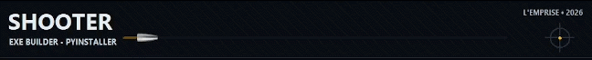

# Shooter

<p align="center">
  
</p>

Shooter est un petit outil GUI (Tkinter) qui permet de transformer un script Python en exécutable Windows via PyInstaller, avec une interface simple, un écran de vérification des dépendances, et des logs intégrés.

## Fonctionnalités

- Génération d’un `.exe` depuis :
  - du code collé dans l’éditeur intégré
  - un fichier `.py` sélectionné
- Choix du nom de l’exécutable et du dossier de sortie
- Icône `.ico` optionnelle
- Options PyInstaller courantes :
  - `--onefile` / `--onedir`
  - `--noconsole` / `--console`
  - hidden-imports (liste)
  - arguments PyInstaller supplémentaires
- Vérification au démarrage :
  - si PyInstaller est présent → l’app s’ouvre normalement
  - sinon → proposition d’installation (quand l’app est lancée via Python)

## Prérequis

- Windows
- Python 3.10+ recommandé (testé avec Python 3.11)
- pip (fourni avec Python)

PyInstaller est requis pour générer des exécutables. L’app peut le proposer automatiquement quand elle est exécutée via Python.

## Installation

1. Cloner le dépôt
2. (Optionnel) Créer un environnement virtuel
3. Lancer l’application

```powershell
python .\exe_generator.py
```

Au premier lancement, Shooter vérifie si PyInstaller est disponible. Si ce n’est pas le cas, un bouton “Installer les dépendances” apparaît.

## Utilisation

1. Renseigner **Nom exe**
2. Choisir une **Icône (.ico)** (optionnel)
3. Choisir le **Mode** :
   - **Code** : coller/éditer du code dans la zone “Code Python”
   - **Fichier** : sélectionner un script `.py`
4. Choisir un **Dossier de sortie**
5. (Optionnel) Ouvrir **Options** pour configurer `onefile`, `sans console`, hidden-imports, args supplémentaires
6. Cliquer **Générer .exe**

Le résultat est copié dans le dossier de sortie choisi, et les logs PyInstaller apparaissent dans la section “Logs”.

## Notes importantes

- **Mode onedir** : PyInstaller produit un dossier complet (avec l’exécutable + dépendances). Shooter copie ce dossier dans le dossier de sortie.
- **Sans console** (`--noconsole`) : adapté aux applis GUI. Pour un script console, désactivez cette option.
- **Hidden-imports** : utile quand PyInstaller “oublie” des imports dynamiques (séparer par espaces, virgules ou retours à la ligne).

## Dépannage

### PyInstaller introuvable

- Si vous exécutez `exe_generator.py` avec Python : utilisez le bouton “Installer les dépendances”.
- Si vous utilisez une version packagée en `.exe` : installez Python + PyInstaller sur la machine, puis relancez la vérification.

Commande typique (PowerShell) :

```powershell
py -3 -m pip install --upgrade pyinstaller
```

### L’icône ne marche pas

- L’icône doit être un fichier `.ico` (pas `.png`/`.svg`).

### Antivirus / SmartScreen

- Les exécutables générés localement peuvent déclencher des alertes. C’est courant avec PyInstaller, surtout sur des machines “propres”.

## Fichiers du projet

- [exe_generator.py](./exe_generator.py) : l’application principale
- [bullet_2.svg](./bullet_2.svg) : asset utilisé par l’UI
- [banner.gif](./banner.gif) : bannière affichée dans ce README
